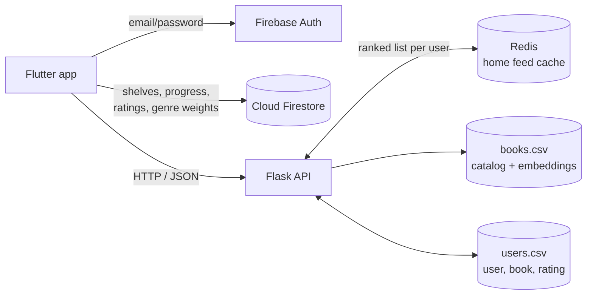

# Book Flix

A Flutter app that recommends books based on what you've read and how you rated it. I built the mobile app, the Flask recommendation API, and the Firebase integration.

## What it does

- **Personalized home feed:** recommendations from user-based collaborative filtering, grouped into rows (your top 3 genres, new, popular, most liked, series).
- **Similar books:** each book page shows the 5 closest books by description embedding.
- **Reading tracker:** shelve books for later, track page progress, then mark finished or did-not-finish with a 1-5 rating. Ratings feed back into recommendations.
- **Search and filter:** search by title, author, or series, and filter by genre.

[Demo video](https://drive.google.com/file/d/19B25kfb0lis11TT9PuT5cbyva8mGCuP2/view?usp=sharing)

## Tech stack

- **Mobile app:** Flutter / Dart, `http`, `flutter_dotenv`, `palette_generator` (cover-based colors), `share_plus`
- **Backend:** Python, Flask, Redis (recommendation cache)
- **Recommendation / search:** pandas, NumPy, SciPy sparse matrices, scikit-learn (cosine similarity, TF-IDF)
- **Auth and user data:** Firebase Authentication (email/password), Cloud Firestore
- **Data:** [Goodreads dataset](https://mengtingwan.github.io/data/goodreads.html) (UCSD, 2017), cleaned into `books.csv` and `users.csv`

## Architecture

The Flutter app talks to two backends. Firebase handles login and stores each user's reading state (shelves, progress, ratings, genre weights). The Flask API holds the book catalog and the full ratings table in memory as pandas DataFrames and does all ranking and search.



**Linking the two:** on first sign-in, the app asks the API for the next free `user_id` and saves it in the user's Firestore doc. When the user rates a book, the app writes it to Firestore and also POSTs it to `/bookflix/add_user_rating`, which appends it to `users.csv`. That puts the new user in the same ratings matrix as the Goodreads users.

**Recommendations (`/bookflix/home_books`):**

1. Find other users who rated at least 1/5 as many of the same books as the current user.
2. Build a sparse user x book ratings matrix (SciPy CSR) from those users.
3. Take the 30 most similar users by cosine similarity.
4. Score each book they rated: `mean_rating * count^2 / goodreads_avg_rating`, then multiply by the user's weight for that book's main genre (set in Settings).
5. Drop books the user has already read, then slice the ranked list into the home-screen rows and sample 20 per row so the feed changes between loads.

**Caching:** steps 1-4 plus the read-book filter give the same ranked list until the user's inputs change, so it's cached in Redis under the user's ID. Repeat home-screen loads skip the collaborative filtering and only re-sample the rows. The entry is cleared when the user rates a book or changes their genre weights.

New users with no ratings get the same scoring over all users (a popularity baseline), still adjusted by genre weights.

**Similar books (`/bookflix/similar_books`):** cosine similarity between Sentence2Vec embeddings of each book's description, precomputed and stored in `books.csv`.

**Search (`/bookflix/search`):** queries under 5 characters use prefix/substring matching on title, author, and series. Longer queries use separate TF-IDF vectors per field, a weighted sum of cosine scores, and a 0.25 threshold.

## Project structure

```
api/
  api.py                 Flask API: recommendations, similar books, search, ratings
app/book_flix/
  pubspec.yaml
  assets/                logo and onboarding images
  lib/
    main.dart            init Firebase + .env
    widget_tree.dart     routes to login, onboarding, or app based on auth state
    getting_started.dart onboarding: assigns user_id, seeds genre weights
    load_data.dart       loads shelves and recommendations before showing tabs
    tab_bar.dart         Home / Shelf / Search / Settings
    home.dart            recommendation rows
    book_view.dart       book detail, progress, rating, similar books, share
    shelf.dart           reading lists
    search.dart          search and genre filters
    settings.dart        edit genre weights
    database_functions.dart  Firestore reads/writes
```

## Getting started

**Data:** download `books.csv` and `users.csv` from [Kaggle](https://www.kaggle.com/datasets/ishitamundra/bookflix-data) (too large for the repo) and put them in `api/`.

**API** (run from the repo root, since the CSV paths are relative to it):

```bash
pip install flask pandas numpy scipy scikit-learn redis
redis-server &           # local Redis on the default port
python api/api.py        # serves on 0.0.0.0:5000
```

**App:**

1. Create a Firebase project with Email/Password auth and Firestore, then add the platform config files (`google-services.json` for Android, `GoogleService-Info.plist` for iOS).
2. Create `app/book_flix/.env` with the API host's IP:
   ```
   IP_ADDRESS=<your machine's local IP>
   ```
3. Run:
   ```bash
   cd app/book_flix
   flutter pub get
   flutter run
   ```
